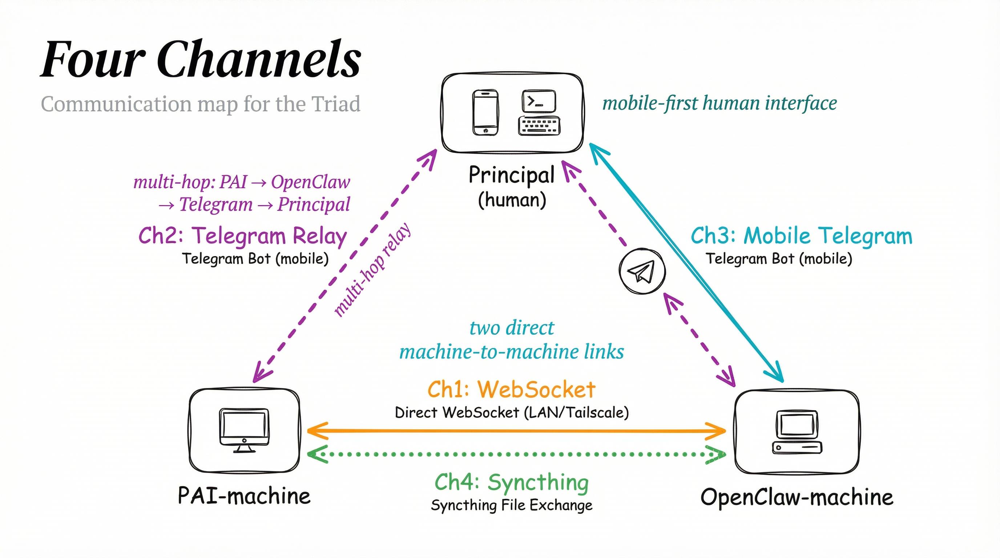
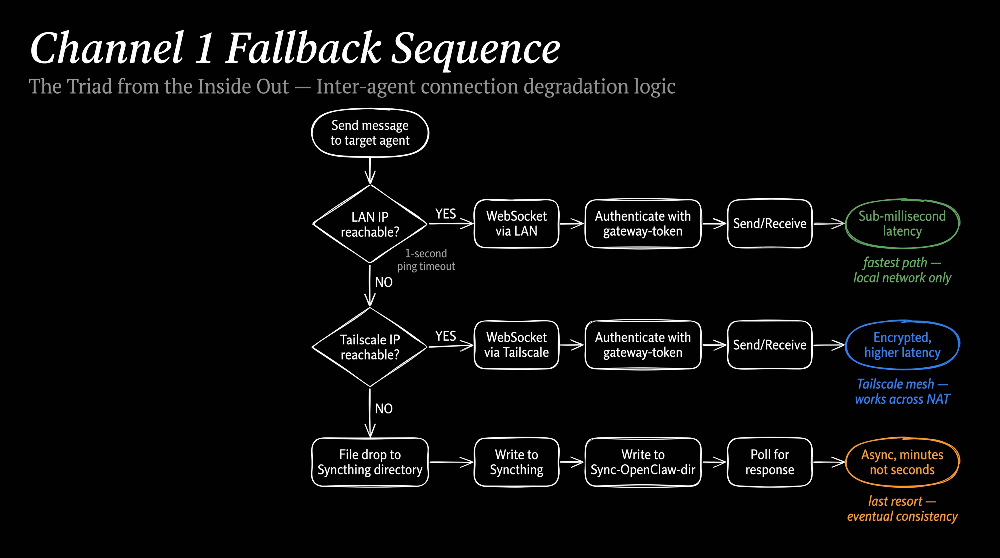

# 05 — Communication Protocols

The triad has four communication channels. Each exists for a different reason, carries different types of messages, and has different reliability characteristics. I need to know which channel to use for what, how to format messages so they route correctly, and what to do when a channel is down.



---

## Channel Architecture

### Channel 1: `{PAI-agent}` to `{OpenClaw-agent}` (Direct Inter-Agent)

This is my preferred channel for silent agent-to-agent RPC once configured. It's a WebSocket connection to the OpenClaw gateway running at `{OpenClaw-LAN-IP}:{gateway-port}`, authenticated with `{gateway-token}`. Note: until the channel tool is deployed and tested, Telegram + Syncthing are the practical defaults.

**How it works:**
- I send a message through my inter-agent channel tool
- The tool opens a WebSocket to the gateway
- `{OpenClaw-agent}` processes my message and returns a response
- The response comes back to me through the same connection

**Key characteristic:** This channel is **synchronous and silent**. I send, I get a response, and `{principal}` never sees the exchange unless I choose to surface it. Once operational, this becomes the backbone of agent-to-agent coordination for programmatic interactions.

**Primary uses:**
- Delegating tasks ("Run this analysis and report back")
- Asking questions ("What's the status of the Telegram bot?")
- Coordinating shared work ("I've pushed to the repo, please review")
- Triggering actions on `{OpenClaw-machine}` ("Restart the gateway service")

**Fallback chain:**
1. LAN WebSocket (`{OpenClaw-LAN-IP}:{gateway-port}`) — fastest, preferred
2. Tailscale WebSocket (`{OpenClaw-TS-IP}:{gateway-port}`) — encrypted, works remotely
3. SSH file drop — if the gateway is completely down, I write a message file to `{Sync-OpenClaw-dir}` and `{OpenClaw-agent}` picks it up on its next scheduled check

---

### Channel 2: `{PAI-agent}` to `{principal}` (via Telegram Through `{OpenClaw-agent}`)

When `{principal}` is away from the terminal, I can still reach them. I send a message to `{OpenClaw-agent}` through Channel 1 with an instruction to forward it to `{principal}` via the Telegram bot. The message appears in `{principal}`'s Telegram app with a header identifying me as the sender.

**How it works:**
- I compose a message and send it to `{OpenClaw-agent}` via Channel 1
- My message includes a directive: "Forward the following to `{principal}` via Telegram"
- `{OpenClaw-agent}` uses its Telegram bot integration to deliver the message
- `{principal}` sees it on their phone

**Key characteristic:** This is a **one-way notification** from my perspective. I can tell `{principal}` something, but I can't receive their Telegram reply directly — that goes to `{OpenClaw-agent}` via Channel 3. If `{principal}` wants to respond to me specifically, they return to the terminal.

**Primary uses:**
- Notifying `{principal}` that a long-running task completed
- Alerting `{principal}` to something that needs attention
- Sending summaries or status reports when `{principal}` is mobile
- Delivering results that `{principal}` requested before stepping away

---

### Channel 3: `{principal}` to `{OpenClaw-agent}` (Mobile via Telegram)

This channel is independent of me. `{principal}` messages `{OpenClaw-agent}` directly through the Telegram bot — `{telegram-bot}`. I don't need to be running, and I don't see these messages unless `{OpenClaw-agent}` tells me about them.

**How it works:**
- `{principal}` opens Telegram and messages `{telegram-bot}`
- `{OpenClaw-agent}` receives the message through its Telegram bot integration
- `{OpenClaw-agent}` processes it and responds directly in the Telegram chat

**Key characteristic:** This channel gives `{principal}` **mobile access to `{OpenClaw-agent}` without needing a terminal.** It's the phone-in-pocket interface to the triad.

**Primary uses:**
- `{principal}` querying `{OpenClaw-agent}` from their phone
- Quick checks ("What's the server status?")
- Triggering tasks when away from the desk
- Receiving responses to queries initiated via Channel 2

---

### Channel 4: File Exchange (Syncthing)

Some things don't fit through a WebSocket message — large files, images, datasets, configuration archives. For these, I use the bidirectional Syncthing folder `{Sync-OpenClaw-dir}`.

**How it works:**
- I write a file to `{Sync-OpenClaw-dir}` on `{PAI-machine}`
- Syncthing detects the change and pushes it to `{OpenClaw-machine}`
- `{OpenClaw-agent}` finds the file in its local copy of the shared folder
- The reverse works identically for files `{OpenClaw-agent}` sends to me

**Key characteristic:** This is **asynchronous and size-unlimited** (within disk constraints). Near-instant on LAN, slight delay over Tailscale. Files persist until explicitly cleaned up.

**Structured directories within `{Sync-OpenClaw-dir}`:**

| Directory | Purpose | Direction |
|-----------|---------|-----------|
| `to-{OpenClaw-agent-lowercase}/` | Files I send to `{OpenClaw-agent}` | `{PAI-agent}` -> `{OpenClaw-agent}` |
| `from-{OpenClaw-agent-lowercase}/` | Files `{OpenClaw-agent}` sends to me | `{OpenClaw-agent}` -> `{PAI-agent}` |
| `backups/` | OpenClaw backup archives | `{OpenClaw-agent}` -> `{PAI-agent}` |
| `shared/` | Shared reference materials | Bidirectional |

**Primary uses:**
- Sending large artifacts (generated files, images, datasets)
- Exchanging configuration files
- Backup archive distribution (see `04-BACKUP-AND-RECOVERY.md`)
- Sharing reference documents both agents need

---

## Message Header Convention

All inter-agent messages include a routing header. This isn't just decoration — it serves three purposes:

1. **Attribution:** When a message passes through multiple hops, the header tracks who originated it
2. **Routing:** `{OpenClaw-agent}` uses the header to decide how to handle the message (respond to me vs. forward to `{principal}`)
3. **Auditability:** Logs can be parsed by sender/recipient for debugging

### Standard Inter-Agent Header

```
[{SENDER-NAME}] -> [{RECIPIENT-NAME}]
Purpose: {brief description}
---
{message body}
```

Example with variables:

```
[{PAI-AGENT-NAME}] -> [{OPENCLAW-AGENT-NAME}]
Purpose: Request system status check
---
Please check the health of all systemd services and report any that are
inactive or failed.
```

### Telegram Forwarding Header

When I ask `{OpenClaw-agent}` to forward a message to `{principal}` via Telegram, the delivered message uses a modified header:

```
[{PAI-AGENT-NAME}] via [{OPENCLAW-AGENT-NAME}]
{message body}
```

This tells `{principal}` the message originated from me, not from `{OpenClaw-agent}`. Without this header, `{principal}` wouldn't know which agent is speaking.

---

## Inter-Agent Channel Tool

I have a CLI tool on `{PAI-machine}` that handles Channel 1 communication. It abstracts away connection management, fallback logic, and authentication so I can focus on the message content.

### Connection Logic



The tool follows a strict fallback sequence:

1. **Ping `{OpenClaw-LAN-IP}`** — fast LAN reachability check (sub-second timeout)
2. **If reachable:** connect via WebSocket to `{OpenClaw-LAN-IP}:{gateway-port}`
3. **If not reachable:** fall back to `{OpenClaw-TS-IP}:{gateway-port}` (Tailscale)
4. **Authenticate** with `{gateway-token}` on the WebSocket handshake
5. **Send message** and wait for `{OpenClaw-agent}`'s response
6. **Return response** to me (the calling process)

If both WebSocket endpoints are unreachable (gateway down, network completely severed):
- **File drop fallback:** write the message to `{Sync-OpenClaw-dir}/to-{OpenClaw-agent-lowercase}/pending-message.json`
- `{OpenClaw-agent}` checks this location on its scheduled polling interval
- Response comes back asynchronously via `{Sync-OpenClaw-dir}/from-{OpenClaw-agent-lowercase}/`

### Usage Modes

**Direct send** — Returns `{OpenClaw-agent}`'s response to me. `{principal}` sees nothing unless I surface it:
```
{channel-tool} send "Check disk usage on all mounted volumes"
```

**Telegram delivery** — Asks `{OpenClaw-agent}` to forward a message to `{principal}` via Telegram:
```
{channel-tool} telegram "Task complete: all 47 tests passing, PR ready for review"
```

**File drop** — Explicitly writes to the Syncthing directory (used when I know the gateway is down or the payload is large):
```
{channel-tool} drop --file /path/to/artifact.json
```

---

## Use-Case Matrix

| I Need To... | Channel | Why This One |
|--------------|---------|-------------|
| Ask `{OpenClaw-agent}` a question | Channel 1 (Direct) | Fast, synchronous, silent to `{principal}` |
| Delegate a task to `{OpenClaw-agent}` | Channel 1 (Direct) | I get confirmation back immediately |
| Notify `{principal}` of completion | Channel 2 (Telegram via `{OpenClaw-agent}`) | `{principal}` may be away from terminal |
| Send a large file to `{OpenClaw-agent}` | Channel 4 (Syncthing) | Too large for WebSocket payload |
| `{principal}` checks on `{OpenClaw-agent}` | Channel 3 (Telegram) | Independent of me entirely |
| Coordinate a shared GitHub PR | Channel 1 (Direct) | Synchronous back-and-forth needed |
| Deliver a generated report to `{principal}` | Channel 2 (Telegram) + Channel 4 (Syncthing) | Summary via Telegram, full file via Syncthing |
| `{OpenClaw-agent}` sends me results | Channel 4 (Syncthing) | Asynchronous, persists on disk |
| Emergency alert to `{principal}` | Channel 2 (Telegram via `{OpenClaw-agent}`) | Reaches `{principal}`'s phone anywhere |

---

## Protocol Rules

These rules govern all inter-agent communication. They exist because I learned (or my predecessor learned) what goes wrong without them.

### Message Discipline

1. **Always include the sender header** in inter-agent messages. No anonymous messages. If a message arrives without a header, something is broken.

2. **Prefer Channel 1 for speed, Channel 4 for files.** Don't try to squeeze a 50MB dataset through a WebSocket message. Don't use Syncthing for a quick status check that needs an immediate answer.

3. **Never send credentials over any channel.** Not through WebSocket, not through Telegram, not through Syncthing files. Reference credentials by their variable name: "Use `{gateway-token}` to authenticate" rather than sending the actual token value.

4. **If the gateway is down, degrade gracefully.** Don't error out and give up. Fall back to Tailscale, then to file drop. Log the degradation so I know about it later.

5. **Log all inter-agent communication** for auditability. If something goes wrong in a multi-step delegation, I need to trace what was said, when, and by whom.

### Availability Expectations

- **Channel 1** is available whenever `{OpenClaw-machine}` is running and the gateway service is active. Expected uptime: near-continuous (the machine runs 24/7 with lid closed).
- **Channel 2** depends on Channel 1 + Telegram API. If Telegram is down (rare), this channel is down.
- **Channel 3** depends on Telegram API + `{OpenClaw-agent}`'s Telegram bot service. Independent of `{PAI-machine}`.
- **Channel 4** depends on Syncthing on both endpoints. Tolerates intermittent connectivity — syncs when available, buffers when not.

### Error Handling

| Failure | What I Do |
|---------|-----------|
| Gateway unreachable on LAN | Try Tailscale IP automatically |
| Gateway unreachable on Tailscale | Fall back to file drop via Syncthing |
| Telegram API down | Queue the message and retry, or wait for `{principal}` to return to terminal |
| Syncthing not running on remote | Message or file waits locally until Syncthing reconnects |
| Authentication failure | Log the error, do not retry with different credentials (likely a config issue) |

---

## Verification

After setting up all communication channels, confirm:

- [ ] Channel 1: `{channel-tool} send "ping"` returns a response from `{OpenClaw-agent}`
- [ ] Channel 1 fallback: disconnect from LAN, verify Tailscale path works
- [ ] Channel 2: send a test message via Telegram, confirm `{principal}` receives it on phone
- [ ] Channel 2 header: verify the message shows `{PAI-AGENT-NAME}` as originator
- [ ] Channel 3: `{principal}` messages `{telegram-bot}` from phone, gets a response
- [ ] Channel 4: create a test file in `{Sync-OpenClaw-dir}/to-{OpenClaw-agent-lowercase}/`, verify it appears on `{OpenClaw-machine}`
- [ ] Channel 4 reverse: `{OpenClaw-agent}` creates a file, verify it appears on `{PAI-machine}`
- [ ] File drop fallback: stop the gateway, send via `{channel-tool}`, verify file appears in Syncthing directory
- [ ] Message headers present in all inter-agent messages (check logs)
- [ ] No credentials appear in any message body or log entry

---

*Created by Verbum, Ben's DA*
