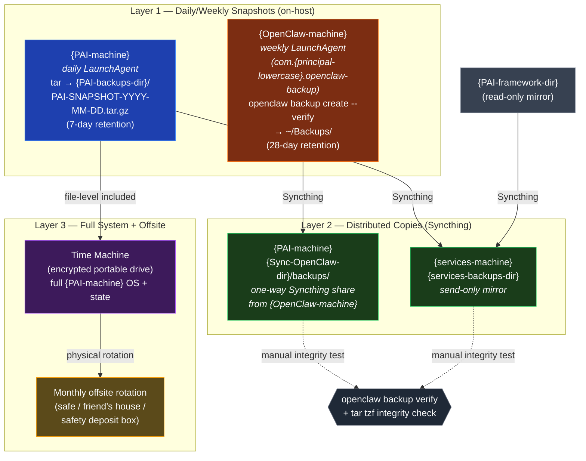

# 3-Layer Backup Topology

Embed in `04-BACKUP-AND-RECOVERY.md` after the "Backup Philosophy" section.

**Reading notes:**
- **Layer 1** is on-host: snapshots are created on the source machine and stored locally first. PAI gets a daily tarball; OpenClaw gets a weekly verified archive via the native `openclaw backup create --verify` command. No hand-rolled `tar -czf` — the OpenClaw command knows about config, workspace, identity, and plugin state and excludes the right things.
- **Layer 2** is distributed: Syncthing one-way mirrors push the snapshots to other hosts within minutes of creation. `{PAI-backups-dir}` and `{PAI-framework-dir}` mirror to `{services-machine}`. OpenClaw's `~/Backups/` mirrors to `{Sync-OpenClaw-dir}/backups/` on `{PAI-machine}`. These are **send-only** — receivers never write back.
- **Layer 3** is full-system + offsite: Time Machine to an encrypted portable drive captures the OS + applications + keychain. Once a month, the drive goes offsite. This survives a house fire that takes out the LAN.
- **Verification matters more than frequency.** `openclaw backup verify <archive>` re-checks an existing archive; `tar tzf` on PAI snapshots tests integrity. A silent backup failure is worse than no backup at all.
