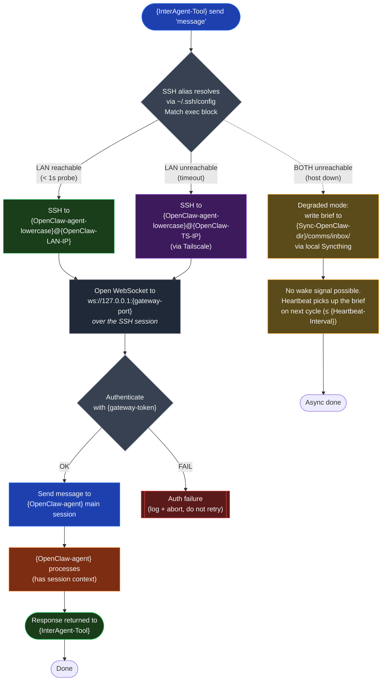

# Channel 1 — SSH→Loopback Fallback Sequence

Embed in `05-COMMUNICATION-PROTOCOLS.md` inside the "Inter-Agent Channel Tool" section.

**Reading notes:**
- The gateway is **loopback only** on `{OpenClaw-machine}` — there is no LAN or Tailscale port to expose. SSH is the entire transport.
- LAN is preferred (faster, no Tailscale relay overhead). The 1-second probe is a `Match exec` block in `~/.ssh/config` that connects via TCP to the LAN IP and falls through if it can't.
- Tailscale is the encrypted fallback for off-LAN scenarios (travel, ISP outage, LAN reconfig).
- If both transports fail, file-drop into `{Sync-OpenClaw-dir}/comms/inbox/` is the only path. Latency in this mode = up to one heartbeat cycle. There is no wake signal — the heartbeat picks up new briefs on its next intake scan.
- Auth failure (token mismatch) is **not retried**. It's almost always a config issue, not a transient problem; retrying with a wrong token wastes time.
