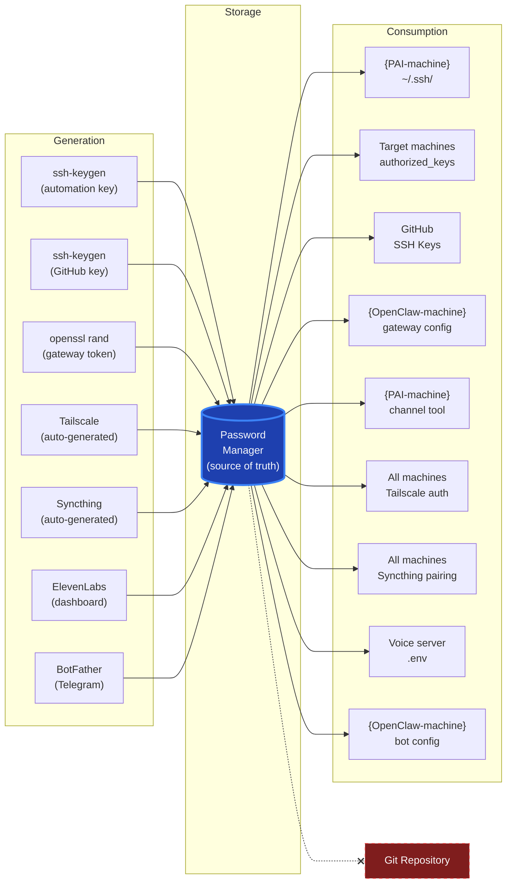

# Credential Flow & Storage Topology

Embed in `SECRETS-SETUP.md` after the "Storage Rules" section, before "Verification."

**Reading notes:**
- All credentials flow through the Password Manager (center hub)
- Each credential exists in exactly two places: the password manager and one consumption point
- The crossed-out path to "Git Repository" reinforces the prohibition
- Tailscale and Syncthing keys are auto-generated but still stored in the password manager for recovery
