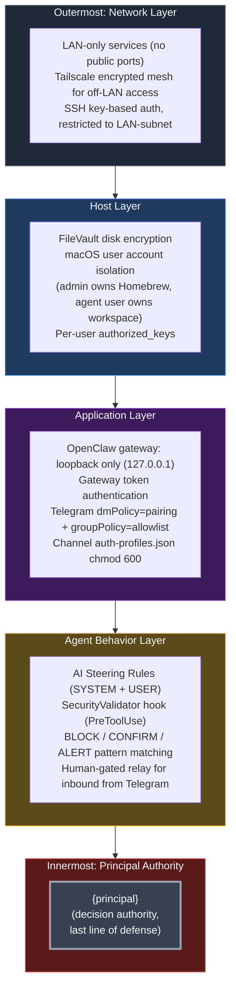

# Defense in Depth — Concentric Security Layers

Embed in `03-SECURITY-MODEL.md` near the top, after the introduction.

**Reading notes:**
- Each layer is independently capable of stopping a class of attack. Defense-in-depth means an attacker has to defeat *every* layer to reach the principal.
- The innermost layer is `{principal}` — no matter how good the automated layers are, the human is the final arbiter on irreversible decisions (force pushes, credential reads, settings changes). The ASK pattern matching surfaces these to the principal explicitly.
- Layer 2 (Application) is where the OpenClaw-specific hardening lives: loopback gateway, `dmPolicy=pairing`, the bot allowlist. These are the doors a network attacker would try first.
- Layer 3 (Agent Behavior) is where prompt injection gets caught: human-gated relay means an agent can't be talked into doing something just by receiving a message.
