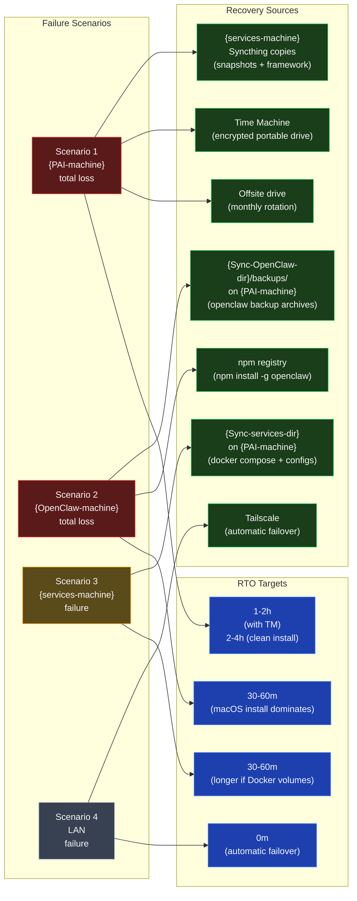

# Disaster Recovery — Source Matrix

Embed in `04-BACKUP-AND-RECOVERY.md` after the "Disaster Recovery Runbooks" section header.

**Reading notes:**
- Each failure scenario has an explicit recovery source AND an RTO target. If a scenario doesn't have both, the runbook is incomplete.
- `{OpenClaw-machine}` recovery is fast (30-60m) because OpenClaw is a single npm package + a config + a workspace; the long pole is the macOS reinstall, not OpenClaw itself.
- Network failure (Scenario 4) has zero RTO because Tailscale's encrypted mesh provides automatic failover. The LAN-down scenario is the *least* disruptive thanks to this.
- The offsite drive (S3) is the last line of defense — it survives fires, floods, and theft of everything inside the home network. Test it at least once a year.
