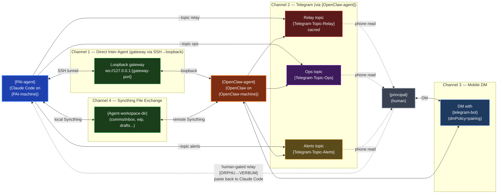

# Four Communication Channels — Map

Embed in `05-COMMUNICATION-PROTOCOLS.md` after the "Channel Architecture" section header.

**Reading notes:**
- **Channel 1** is silent (`{principal}` doesn't see it) and synchronous. The gateway is loopback-only — every connection from `{PAI-machine}` is *over* an SSH tunnel into the agent user's session.
- **Channel 2** is `{PAI-agent}` → Telegram via `{OpenClaw-agent}` as a relay. Three topics, strict separation: Relay (escalations only, sacred), Ops (routine status, mostly silent), Alerts (failures + backup results).
- **Channel 3** is `{principal}` ↔ `{OpenClaw-agent}` directly. `dmPolicy=pairing` means only `{Principal-Telegram-User-ID}` can DM the bot.
- **Channel 4** is the Syncthing-mirrored agent workspace. Briefs go in `comms/inbox/`, work artifacts in `wip/`. This is the durable backbone of file-first tasking — see `08-TASKING-PROTOCOL.md`.
- The dotted line back from `{principal}` to `{PAI-agent}` is the **human-gated relay**: there's no automated `{OpenClaw-agent}` → `{PAI-agent}` path. `{principal}` reads, copies, pastes. Eliminates prompt injection from the Telegram side.
