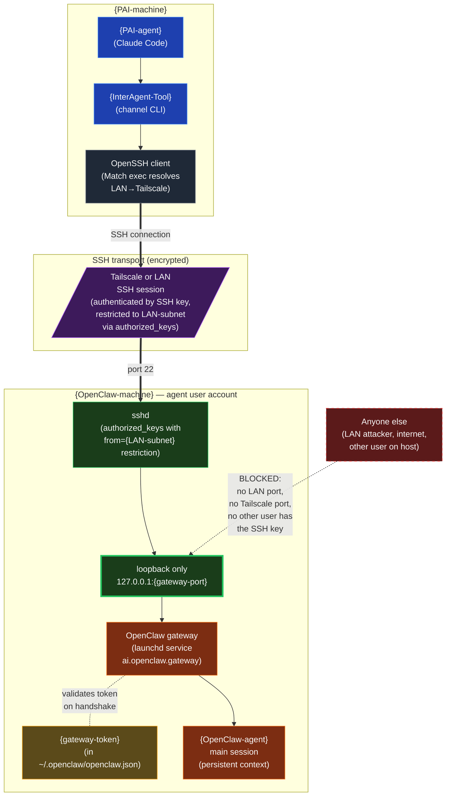

# OpenClaw Gateway — Trust Boundary

Embed in `07-OPENCLAW-APPENDIX.md` near the start of "Section 3: Gateway Service".

**Reading notes:**
- **Two-factor security:** the SSH key authenticates the *transport*, the gateway token authenticates the *application*. Either one alone is insufficient.
- **The gateway never opens a LAN port.** It binds to `127.0.0.1:{gateway-port}` only — verifiable with `lsof -nP -iTCP:{gateway-port}` (you should see only loopback addresses, never `*` or a LAN IP).
- **The SSH key is restricted server-side** to `from={LAN-subnet}` in `authorized_keys`. Even if the key leaks, it only works from the local network. Tailscale traffic appears to come from the Tailscale CGNAT range — extend the `from=` clause if you use Tailscale paths.
- **Other macOS user accounts on the host cannot reach the gateway** unless they have the SSH key AND the gateway token AND can authenticate to the agent user's sshd. Filesystem permissions on `~/.openclaw/openclaw.json` (chmod 600) keep the token sealed inside the agent user.
- **Never expose the gateway port directly** via port forwarding, reverse proxies, or `localhost.run`-style tunnels. The loopback boundary is the entire security model — punching through it removes the SSH layer that makes everything else safe.
