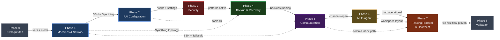

# Implementation Phase Pipeline

Embed in `IMPLEMENTATION-CHECKLIST.md` after the title, before Phase 0.

```mermaid
graph LR
    P0["Phase 0<br/>Prerequisites"]
    P1["Phase 1<br/>Machines & Network"]
    P2["Phase 2<br/>PAI Configuration"]
    P3["Phase 3<br/>Security"]
    P4["Phase 4<br/>Backup & Recovery"]
    P5["Phase 5<br/>Communication"]
    P6["Phase 6<br/>Multi-Agent"]
    P7["Phase 7<br/>Tasking Protocol<br/>& Heartbeat"]
    P8["Phase 8<br/>Validation"]

    P0 -->|"vars + creds"| P1
    P1 -->|"SSH + Syncthing"| P2
    P2 -->|"hooks + settings"| P3
    P3 -->|"patterns active"| P4
    P4 -->|"backups running"| P5
    P5 -->|"channels open"| P6
    P6 -->|"triad operational"| P7
    P7 -->|"file-first flow proven"| P8

    P1 -.->|"Syncthing topology"| P4
    P1 -.->|"SSH + Tailscale"| P5
    P2 -.->|"tools dir"| P5
    P5 -.->|"comms inbox path"| P7
    P6 -.->|"workspace layout"| P7

    style P0 fill:#374151,stroke:#6B7280,color:#F9FAFB
    style P1 fill:#1E3A5F,stroke:#3B82F6,color:#F9FAFB
    style P2 fill:#1E3A5F,stroke:#3B82F6,color:#F9FAFB
    style P3 fill:#5B1A1A,stroke:#EF4444,color:#F9FAFB
    style P4 fill:#1A3D1A,stroke:#22C55E,color:#F9FAFB
    style P5 fill:#3D1A5B,stroke:#A855F7,color:#F9FAFB
    style P6 fill:#5B4A1A,stroke:#F59E0B,color:#F9FAFB
    style P7 fill:#7C2D12,stroke:#F97316,color:#F9FAFB
    style P8 fill:#374151,stroke:#6B7280,color:#F9FAFB
```

**Reading notes:**
- Solid arrows = primary sequential dependencies (must complete in order)
- Dashed arrows = cross-phase dependencies (Phase 4 needs Syncthing from Phase 1, Phase 5 needs SSH from Phase 1 and tools from Phase 2, Phase 7 needs the channel CLI from Phase 5 and the workspace from Phase 6)
- Phase 7 (Tasking Protocol & Heartbeat) is the operational doctrine that ties Channel 1 (gateway) and Channel 4 (Syncthing) together — without it, Phases 5+6 are technically wired but not behaviorally sound
- Gate conditions shown on solid arrow labels
