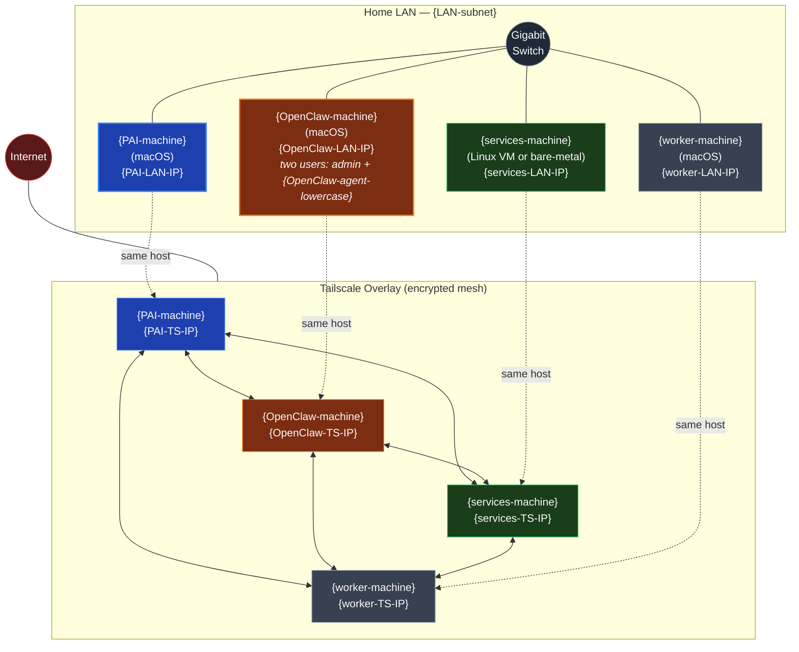

# Network Topology — LAN + Tailscale Overlay

Embed in `01-HOST-AND-NETWORK.md` after the "Machine Topology" table.

**Reading notes:**
- LAN is the preferred path (sub-millisecond, no encryption overhead) — every machine prefers its LAN IP first
- Tailscale is the encrypted mesh fallback: works when off-LAN, when LAN drops, or when reaching the host via Tailscale SSH from outside
- All four machines join the same Tailscale account; the channel CLI on `{PAI-machine}` automatically falls through LAN→Tailscale via a `Match exec` block in `~/.ssh/config`
- `{OpenClaw-machine}` runs two macOS user accounts: `admin` (owns Homebrew + global npm) and `{OpenClaw-agent-lowercase}` (owns the workspace and gateway LaunchAgent)
- The hypervisor role is omitted here — only present if `{services-machine}` runs as a Proxmox VM
