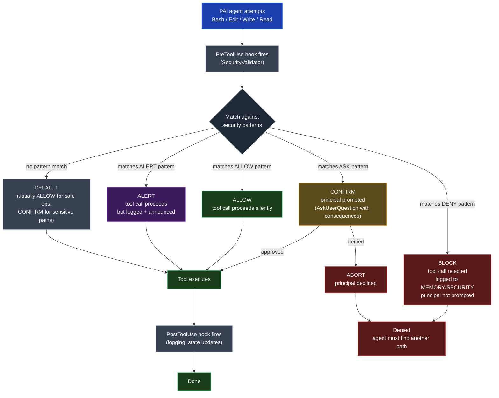

# Tool Invocation — Decision Flowchart

Embed in `03-SECURITY-MODEL.md` near the SecurityValidator section.

**Reading notes:**
- **BLOCK** is non-negotiable. The tool call never executes. The principal is *not* prompted because we don't want to give the agent any lever to argue past it.
- **CONFIRM** is the explicit consent path: the principal sees the action plus its consequences (force push will rewrite remote history, credential read exposes the file contents, etc.) and approves or denies.
- **ALERT** allows the action but creates an audit trail and a notification — useful for "I want to know this happened but it's not worth blocking."
- The default is ALLOW for everyday operations (file reads in the project, normal `git status`, etc.) and CONFIRM for sensitive paths (anything in `~/.ssh/`, `~/.openclaw/`, `settings.json`).
- Patterns live in `{PAI-Dir}/skills/PAI/USER/PAISECURITYSYSTEM/` so they survive PAI upgrades. (Template variable braces are intentionally NOT used inside the diagram nodes themselves because Mermaid parses `{...}` as a rhombus shape delimiter — the reading notes and body text are where variables go.)
