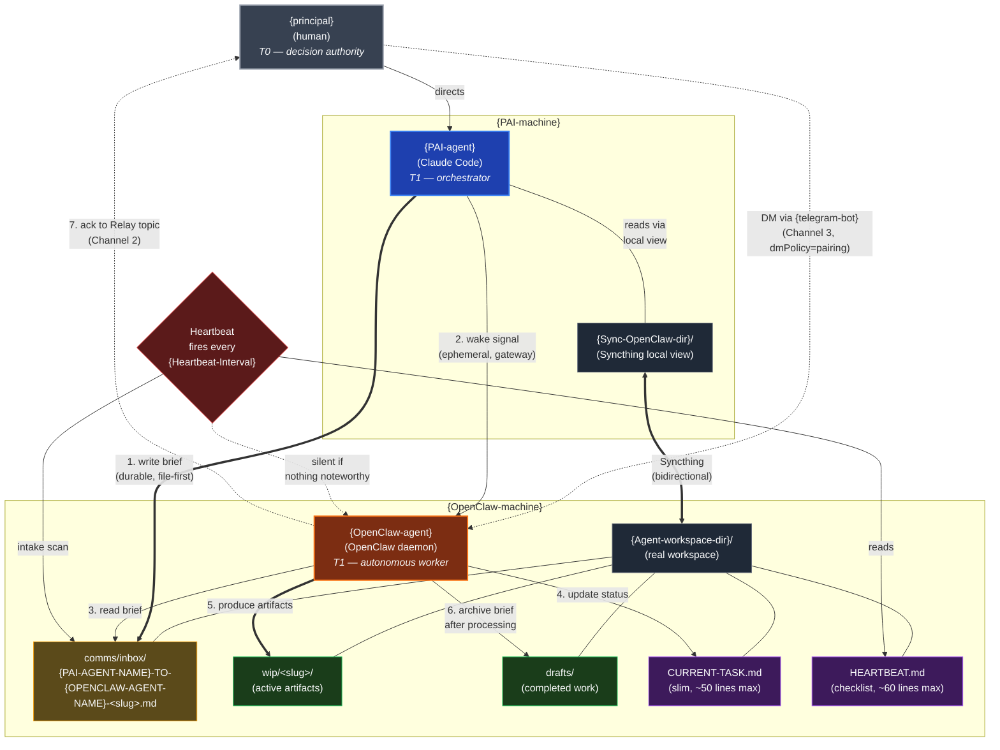

# Triad Entity Relationship and Delegation Flow

Embed in `06-MULTI-AGENT-COORDINATION.md` after "The Triad Pattern" section.

**Reading notes:**
- **Thick arrows = file-first tasking flow.** The brief lives in `comms/inbox/` (durable). The wake signal is ephemeral. The artifacts live in `wip/`. After processing, the brief is archived. This is the entire shape of a delegation.
- **`{OpenClaw-agent}`'s workspace appears in two places** — physically on `{OpenClaw-machine}` at `{Agent-workspace-dir}/`, and as a Syncthing-mirrored view at `{Sync-OpenClaw-dir}/` on `{PAI-machine}`. `{PAI-agent}` reads and writes through the local view; Syncthing handles the rest.
- **The heartbeat is for health, not tasking.** It reads `HEARTBEAT.md` (the checklist), scans `comms/inbox/` (intake), and posts to Ops only if something noteworthy happened. Silence is the default. Stalls are detected by comparing `last_checkpoint_utc` across cycles — see `08-TASKING-PROTOCOL.md`.
- **`{principal}` can DM `{OpenClaw-agent}` directly** without going through `{PAI-agent}`. That's Channel 3 (dotted line). `{principal}` is T0 and always has the option.
- The relationship between `{PAI-agent}` and `{OpenClaw-agent}` is **peer-to-peer with `{principal}` as the shared parent**, not a strict hierarchy. Either agent can initiate, propose, ask, or escalate.
